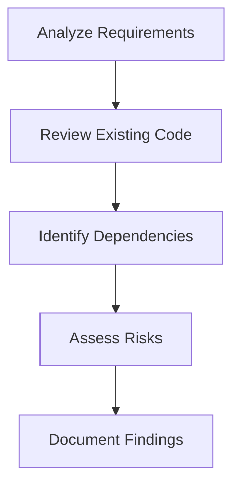

# Aura Development Workflow

## Development Process

### 1. Analysis Phase


### 2. Planning Phase
- Create detailed technical specifications
- Define success criteria
- Plan logging strategy
- Plan rollback procedures
- Document test cases

### 3. Approval Phase
- Submit plan for review
- Address feedback
- Get formal approval
- Schedule implementation

## Implementation Guidelines

### Logging Standards
```python
# Example logging configuration
import logging
from datetime import datetime

logging.basicConfig(
    level=logging.INFO,
    format='%(asctime)s - %(name)s - %(levelname)s - %(message)s',
    handlers=[
        logging.FileHandler(f'logs/aura_{datetime.now().strftime("%Y%m%d")}.log'),
        logging.StreamHandler()
    ]
)
logger = logging.getLogger(__name__)
```

### Code Implementation Steps
1. Create feature branch from `main`
2. Implement changes in small, testable units
3. Add comprehensive logging
4. Write unit tests
5. Update documentation
6. Create pull request

## Debugging Process

### 1. Log Analysis
```bash
# View logs
cat /var/log/aura/application.log | grep "ERROR"

# Follow logs in real-time
tail -f /var/log/aura/application.log

# Search for specific patterns
grep -r "Exception" /var/log/aura/
```

### 2. Root Cause Analysis
- Identify error patterns
- Check system metrics
- Review recent changes
- Reproduce the issue
- Document findings

### 3. Validation Process
```python
def validate_change():
    """
    Example validation function
    Returns:
        dict: Validation results with status and details
    """
    try:
        # Test the change
        result = test_implementation()
        
        # Verify results
        assert result['status'] == 'success', "Implementation failed"
        
        return {
            'status': 'success',
            'message': 'Validation passed',
            'details': result
        }
    except Exception as e:
        logger.error(f"Validation failed: {str(e)}")
        return {
            'status': 'failed',
            'message': str(e),
            'traceback': traceback.format_exc()
        }
```

## Code Maintenance

### Stale Code Removal
```python
def cleanup_old_code(base_path):
    """
    Remove deprecated code and its references
    """
    deprecated_patterns = [
        'legacy_',
        '_deprecated',
        # Add other patterns to identify stale code
    ]
    
    for root, _, files in os.walk(base_path):
        for file in files:
            if any(pattern in file for pattern in deprecated_patterns):
                file_path = os.path.join(root, file)
                os.remove(file_path)
                logger.info(f"Removed deprecated file: {file_path}")
```

### Backup Strategy
```bash
# Create backup before major changes
TIMESTAMP=$(date +%Y%m%d_%H%M%S)
BACKUP_DIR="/backups/aura_${TIMESTAMP}"
mkdir -p "${BACKUP_DIR}"

# Backup database
pg_dump -U postgres -d aura > "${BACKUP_DIR}/aura_db.sql"

# Backup code
rsync -av --exclude='node_modules' --exclude='.git' /app "${BACKUP_DIR}/"

# Verify backup
if [ $? -eq 0 ]; then
    echo "Backup completed successfully in ${BACKUP_DIR}"
else
    echo "Backup failed!"
    exit 1
fi
```

## Review and Approval

### Code Review Checklist
- [ ] Logging is comprehensive
- [ ] Error handling is robust
- [ ] Tests are included
- [ ] Documentation is updated
- [ ] Performance impact assessed
- [ ] Security review completed

### Approval Workflow
1. Developer creates PR
2. Automated tests run
3. Code review by team
4. Security review
5. Final approval
6. Merge to main

## Monitoring and Maintenance

### Key Metrics to Monitor
- Error rates
- Response times
- Resource usage
- Queue lengths
- Success rates

### Alerting Strategy
- Real-time alerts for critical errors
- Daily summary reports
- Weekly performance reports
- Monthly trend analysis

## Documentation

### Required Documentation
- API documentation
- Deployment guides
- Troubleshooting guides
- Architecture diagrams
- Runbooks

## Rollback Plan

### Automated Rollback
```python
def rollback_change(backup_dir):
    """
    Rollback to previous working state
    """
    try:
        # Stop services
        stop_services()
        
        # Restore database
        restore_database(backup_dir)
        
        # Restore code
        restore_code(backup_dir)
        
        # Start services
        start_services()
        
        logger.info("Rollback completed successfully")
        return True
    except Exception as e:
        logger.critical(f"Rollback failed: {str(e)}")
        return False
```

## Continuous Improvement

### Retrospective Process
1. After each release:
   - Review what went well
   - Identify improvement areas
   - Update development workflow
   - Document lessons learned

### Metrics Tracking
- Deployment frequency
- Lead time for changes
- Change failure rate
- Mean time to recover

---

This workflow ensures:
1. Systematic development approach
2. Comprehensive logging and debugging
3. Safe code changes with rollback capability
4. Continuous improvement through metrics
5. Clear documentation and knowledge sharing
