{
  "name": "42Gears AI Tech Lead Workflow",
  "nodes": [
    {
      "parameters": {
        "path": "freshdesk-mcp-trigger",
        "httpMethod": "POST",
        "options": {}
      },
      "name": "Freshdesk MCP Trigger",
      "type": "n8n-nodes-base.webhook",
      "typeVersion": 1,
      "position": [250, 300],
      "notes": "🚀 Trigger from Freshdesk MCP on ticket assignment.\nAccepts POST payload with ticket details."
    },
    {
      "parameters": {
        "functionCode": "const ticket = $json;\n// Skip logic: Only process high/medium priority, technical tickets\nconst skip = !['high', 'medium'].includes(ticket.priority?.toLowerCase()) || ticket.type?.toLowerCase() !== 'technical';\nreturn [{ skipAI: skip, ticket }];"
      },
      "name": "Smart Ticket Filter",
      "type": "n8n-nodes-base.function",
      "typeVersion": 1,
      "position": [500, 300],
      "notes": "⚡ Filters out simple/low-value tickets to save AI cost."
    },
    {
      "parameters": {
        "conditions": {
          "boolean": [],
          "string": [
            {
              "value1": "={{$json[\"skipAI\"]}}",
              "operation": "isEqual",
              "value2": "false"
            }
          ]
        }
      },
      "name": "AI Processing Needed?",
      "type": "n8n-nodes-base.if",
      "typeVersion": 1,
      "position": [750, 300],
      "notes": "🔀 Routes only complex tickets to AI nodes."
    },
    {
      "parameters": {
        "url": "https://knowledgebase.42gears.com/search?q={{$json[\"ticket\"][\"subject\"]}}",
        "responseFormat": "string",
        "options": {}
      },
      "name": "KB Retrieval",
      "type": "n8n-nodes-base.httpRequest",
      "typeVersion": 1,
      "position": [1000, 200],
      "notes": "📚 Retrieves relevant KB content based on ticket subject."
    },
    {
      "parameters": {
        "url": "https://docs.42gears.com/search?q={{$json[\"ticket\"][\"subject\"]}}",
        "responseFormat": "string",
        "options": {}
      },
      "name": "Docs Retrieval",
      "type": "n8n-nodes-base.httpRequest",
      "typeVersion": 1,
      "position": [1000, 400],
      "notes": "📘 Retrieves relevant product documentation."
    },
    {
      "parameters": {
        "functionCode": "const kbContent = $items(\"KB Retrieval\", 0).json;\nconst docsContent = $items(\"Docs Retrieval\", 0).json;\nconst ticket = $json.ticket;\nreturn [{\n  ticket,\n  knowledge: (kbContent || '') + '\\n' + (docsContent || '')\n}];"
      },
      "name": "Merge KB + Docs",
      "type": "n8n-nodes-base.function",
      "typeVersion": 1,
      "position": [1250, 300],
      "notes": "🧩 Combines KB and Docs content for AI context."
    },
    {
      "parameters": {
        "operation": "chat",
        "model": "gpt-4o-mini",
        "messages": [
          {
            "text": "You are a senior 42Gears technical architect. Analyze the support ticket and provide:\n1. Root cause analysis\n2. Step-by-step solution\n3. Preventive measures\n4. Relevant KB/Docs references\n\nTicket:\n{{$json.ticket.description}}\n\nKnowledge:\n{{$json.knowledge}}",
            "role": "user"
          }
        ],
        "temperature": 0.3,
        "maxTokens": 1000
      },
      "name": "AI Tech Lead Analysis",
      "type": "n8n-nodes-base.openAi",
      "typeVersion": 1,
      "position": [1500, 300],
      "credentials": {
        "openAIApi": "openai-42gears"
      },
      "notes": "🤖 Generates tech-lead style solution using GPT."
    },
    {
      "parameters": {
        "url": "https://your-mcp-endpoint/addInternalNote",
        "method": "POST",
        "jsonParameters": true,
        "options": {},
        "body": {
          "ticket_id": "={{$json.ticket.id}}",
          "note": "={{$json[\"data\"] || $json[\"content\"]}}"
        }
      },
      "name": "Add Internal Note",
      "type": "n8n-nodes-base.httpRequest",
      "typeVersion": 1,
      "position": [1750, 300],
      "notes": "📤 Sends AI output back to Freshdesk as an internal note via MCP."
    }
  ],
  "connections": {
    "Freshdesk MCP Trigger": {
      "main": [
        [
          {
            "node": "Smart Ticket Filter",
            "type": "main",
            "index": 0
          }
        ]
      ]
    },
    "Smart Ticket Filter": {
      "main": [
        [
          {
            "node": "AI Processing Needed?",
            "type": "main",
            "index": 0
          }
        ]
      ]
    },
    "AI Processing Needed?": {
      "main": [
        [
          {
            "node": "KB Retrieval",
            "type": "main",
            "index": 0
          },
          {
            "node": "Docs Retrieval",
            "type": "main",
            "index": 0
          }
        ]
      ]
    },
    "KB Retrieval": {
      "main": [
        [
          {
            "node": "Merge KB + Docs",
            "type": "main",
            "index": 0
          }
        ]
      ]
    },
    "Docs Retrieval": {
      "main": [
        [
          {
            "node": "Merge KB + Docs",
            "type": "main",
            "index": 0
          }
        ]
      ]
    },
    "Merge KB + Docs": {
      "main": [
        [
          {
            "node": "AI Tech Lead Analysis",
            "type": "main",
            "index": 0
          }
        ]
      ]
    },
    "AI Tech Lead Analysis": {
      "main": [
        [
          {
            "node": "Add Internal Note",
            "type": "main",
            "index": 0
          }
        ]
      ]
    }
  }
}


Key points for your engineers:

Trigger: Webhook from Freshdesk MCP server → Node 1.

Filter: Node 2 ensures only high-value tickets go to AI.

Parallel Retrieval: Nodes 4 & 5 hit public KB & Docs.

Merge: Node 6 combines context into a single string for the AI.

AI Generation: Node 7 runs GPT with tech lead persona.

Output: Node 8 posts AI’s solution back as an internal note.

graph TD
    A[📥 Freshdesk MCP Trigger<br/>Webhook from MCP server] --> B[⚡ Smart Ticket Filter<br/>Skip low-value tickets]
    B --> C[🔀 AI Processing Needed?<br/>IF node to decide AI route]
    C -->|true| D1[📚 KB Retrieval<br/>HTTP Request to KB site]
    C -->|true| D2[📘 Docs Retrieval<br/>HTTP Request to Docs site]
    D1 --> E[🧩 Merge KB + Docs<br/>Combine knowledge sources]
    D2 --> E
    E --> F[🤖 AI Tech Lead Analysis<br/>OpenAI GPT prompt]
    F --> G[📤 Add Internal Note<br/>POST back to MCP/Freshdesk]


# 42Gears AI Tech Lead Workflow

## Mermaid Diagram

```mermaid
graph TD
    A[📥 Freshdesk MCP Trigger<br/>Webhook from MCP server] --> B[⚡ Smart Ticket Filter<br/>Skip low-value tickets]
    B --> C[🔀 AI Processing Needed?<br/>IF node to decide AI route]
    C -->|true| D1[📚 KB Retrieval<br/>HTTP Request to KB site]
    C -->|true| D2[📘 Docs Retrieval<br/>HTTP Request to Docs site]
    D1 --> E[🧩 Merge KB + Docs<br/>Combine knowledge sources]
    D2 --> E
    E --> F[🤖 AI Tech Lead Analysis<br/>OpenAI GPT prompt]
    F --> G[📤 Add Internal Note<br/>POST back to MCP/Freshdesk]
```


## n8n Workflow JSON
```json
{
  "name": "42Gears AI Tech Lead Workflow",
  "nodes": [
    {"name": "Freshdesk MCP Trigger", "type": "webhook", "params": {}},
    {"name": "Smart Ticket Filter", "type": "function", "params": {}},
    {"name": "AI Processing Needed?", "type": "if", "params": {}},
    {"name": "KB Retrieval", "type": "httpRequest", "params": {}},
    {"name": "Docs Retrieval", "type": "httpRequest", "params": {}},
    {"name": "Merge KB + Docs", "type": "function", "params": {}},
    {"name": "AI Tech Lead Analysis", "type": "openai", "params": {}},
    {"name": "Add Internal Note", "type": "httpRequest", "params": {}}
  ]
}
```