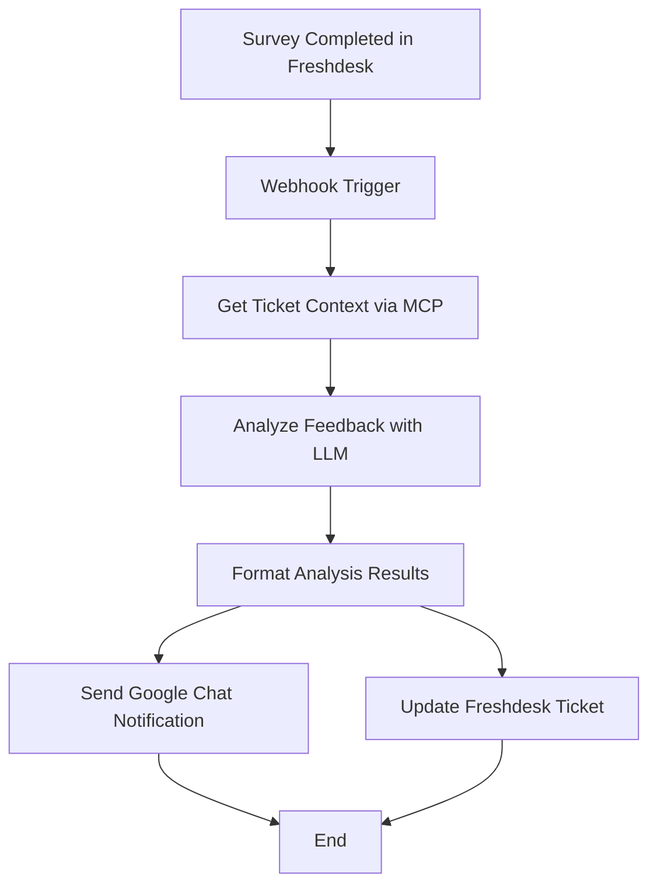

# Customer Survey Response Automation Workflow

## Overview
This document outlines the workflow for automating the processing and analysis of customer survey responses in the Aura support automation platform. The workflow is triggered when a customer completes a CSAT/NPS survey in Freshdesk.

## Workflow Diagram


## Detailed Steps

### 1. Webhook Trigger
- **Trigger**: Freshdesk survey completion
- **Endpoint**: `POST /webhook/freshdesk/survey`
- **Authentication**: API Key
- **Payload Example**:
  ```json
  {
    "event": "survey_completed",
    "ticket_id": "12345",
    "survey_score": 8,
    "survey_comments": "The support was helpful but took longer than expected."
  }
  ```

### 2. Get Ticket Context
- **Service**: MCP Server
- **Endpoint**: `POST /api/tools/get_ticket_context`
- **Input**: `{ "ticket_id": "12345" }`
- **Output**: Full ticket details and conversation history

### 3. Analyze Feedback
- **Service**: Ollama LLM
- **Model**: llama3.1-8b
- **Prompt**:
  ```
  Analyze this customer feedback and provide insights:
  
  Ticket: [ticket_details]
  Survey Score: [score]/10
  Comments: [survey_comments]
  
  Provide analysis in JSON format with: sentiment, key_issues, suggested_actions, and follow_up_required (boolean).
  ```

### 4. Format Analysis Results
- **Process**: Transform LLM output into structured data
- **Output Format**:
  ```json
  {
    "ticket_id": "12345",
    "score": 8,
    "sentiment": "positive",
    "key_issues": ["response time"],
    "suggested_actions": ["Review response time metrics", "Follow up with customer"],
    "follow_up_required": true
  }
  ```

### 5. Send Google Chat Notification
- **Endpoint**: Google Chat Webhook
- **Format**: Interactive Card
- **Content**:
  - Survey Score
  - Sentiment Analysis
  - Key Issues
  - Suggested Actions
  - Direct Link to Ticket

### 6. Update Freshdesk Ticket
- **Action**: Add private note with analysis
- **Content**:
  - Sentiment analysis
  - Key issues identified
  - Suggested follow-up actions
  - Timestamp of analysis

## Error Handling

### 1. Webhook Validation
- Verify required fields
- Validate ticket ID format
- Check survey score range (1-10)

### 2. API Error Handling
- Retry failed API calls (max 3 retries)
- Log errors to monitoring system
- Alert for critical failures

### 3. Rate Limiting
- Implement rate limiting for LLM API calls
- Queue processing during high volume

## Monitoring and Metrics

### Success Metrics
- Processing time
- Sentiment distribution
- Follow-up rate
- Response accuracy

### Error Tracking
- Failed API calls
- Processing errors
- Notification failures

## Security Considerations

### Data Protection
- Encrypt sensitive data in transit and at rest
- Mask PII in logs
- Regular security audits

### Access Control
- Restrict webhook access
- Rotate API keys regularly
- Implement IP whitelisting

## Deployment Requirements

### Services
- n8n instance
- MCP server
- Ollama with Llama 3.1 8B
- Freshdesk API access
- Google Chat webhook URL

### Environment Variables
```
MCP_API_KEY=your_mcp_api_key
FRESHDESK_DOMAIN=yourdomain.freshdesk.com
FRESHDESK_API_KEY=your_freshdesk_api_key
GOOGLE_CHAT_WEBHOOK_URL=your_google_chat_webhook_url
OLLAMA_HOST=http://ollama:11434
```

## Testing

### Unit Tests
- Webhook validation
- LLM response parsing
- Error handling

### Integration Tests
- End-to-end workflow
- API connectivity
- Notification delivery

### Load Testing
- High volume of survey responses
- Concurrent processing
- System resource usage

## Maintenance

### Regular Checks
- Monitor processing queue
- Review error logs
- Update LLM prompts as needed

### Version Control
- Track changes to workflow
- Maintain version history
- Document updates

## Related Documents
- [MCP Server API Documentation](mcp_api.md)
- [Freshdesk Integration Guide](freshdesk_integration.md)
- [n8n Workflow Configuration](n8n_configuration.md)

## Changelog

### 1.0.0 (2025-08-03)
- Initial version of the workflow document
- Includes basic workflow steps and error handling
- Added monitoring and security considerations
